<div align="center">
    <h1>.dotfiles</h1>
    <p>
    
    <br><br>
    </p>
</div>

## Table of Contents

+ [Screenshots](#screenshots)
+ [Introduction](#introduction)
+ [Arch Linux](#ARCH)
+ [Polybar](#Polybar)
+ [Tmux](#Tmux)

## Screenshots

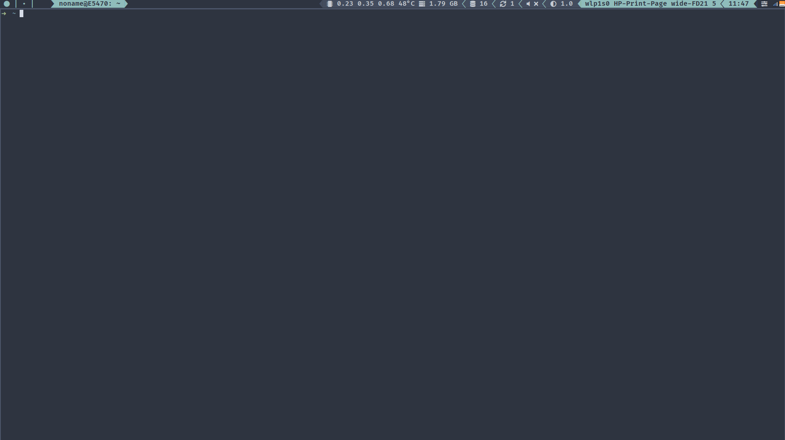

<div align="center">
    <h1>Beautiful color space by</h1>
    <a href="https://github.com/arcticicestudio">Arctic Ice Studio</a>
</div>


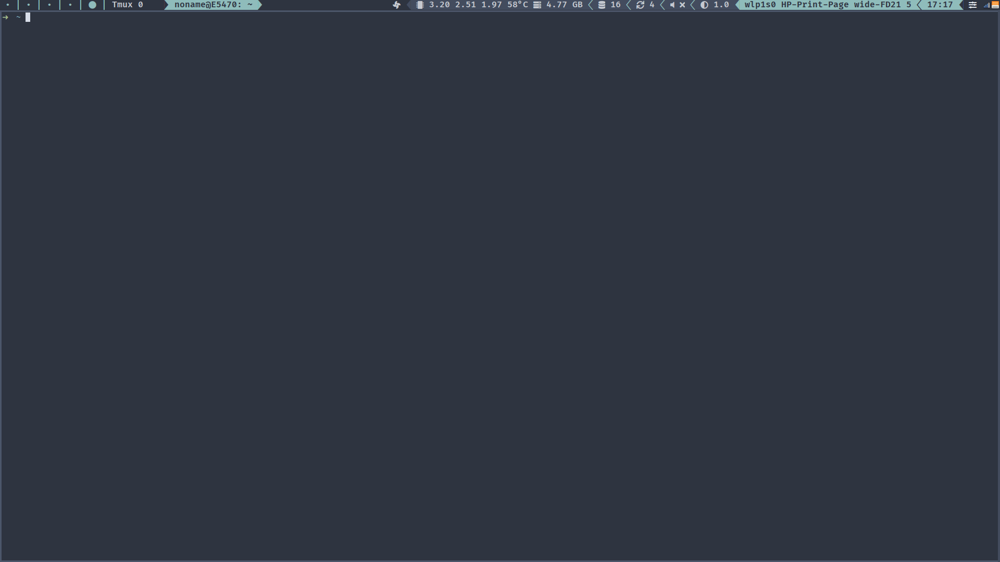

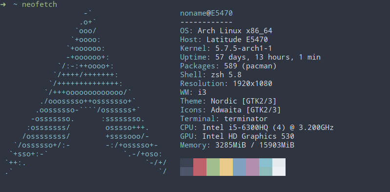

The nord theme may not seem contrasting enough to you [(issue #195)](https://github.com/arcticicestudio/nord-vim/issues/195) and you'd be right. The [script](.config/polybar/brightnessdesktop.sh) is used to change the gamma, when you raise the brightness in monitor to max.


## Introduction

This repository contains my personal configuration files (also known as *dotfiles*). First of all I wanted to show the functionality of my WM.

- Distro: [Arch Linux](https://www.archlinux.org/)
- DE(WM): [I3](https://i3wm.org/)
- Panel: [Polybar](https://github.com/polybar/polybar) , [Rofi](https://github.com/davatorium/rofi) , [Dunst](https://github.com/dunst-project/dunst)
- Shell: [Zsh](https://github.com/zsh-users)
- File manager: [Ranger](https://github.com/ranger/ranger)
- Text editor: [vim/nvim](vim/nvim)

## Arch

#### Install

For installation i use [Arch Linux Install Script (or alis)](https://github.com/picodotdev/alis). The list of installed packages can be found in the [alis.conf](https://github.com/NONVME/alis/blob/master/alis.conf#L86). In the same repository you can see the commits with the addition of I3.

#### Backup

For backups, I use two methods:

- Squashfs
- Rsync
  - [script for backup](config_backup.sh)
  - [script for restore](config_restore.sh)

## Polybar

The configuration provides two options:

for laptop monitor:

```bash
xrandr -q |polybar -m|grep "eDP1" |cut -d: -f1
```

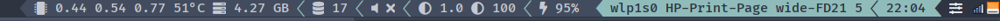

and desktop monitor:

```bash
xrandr -q |polybar -m|grep "HDMI1" |cut -d: -f1
```

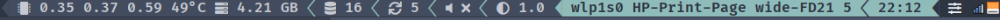

[Autorandr](https://github.com/phillipberndt/autorandr) will help with switching monitors. After each switch press `Mod+R` to reload the config.

I often hear that Arch users have red eyes, [redshift](https://github.com/jonls/redshift) can help with this. These and other scripts are placed in a separate menu.

|       |          |          |         |
| :---: | :------: | :------: | :-----: |
| Power | Monitors | Redshift | Tachpad |

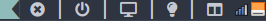

Also on the panel you can see:

- Info Tmux session
- Ping/Ip
- Title
- Loadavg/Temperature/Memory used
- Services
- Pacman-Aur helper
- Alsa mixer/Brightnes/Battery
- Wireless/Wired network
- Clock/Menu
- Networkmanager aplet/Udiskie

## Tmux

Light configuration with CPU monitor available for local use:

- medium load >30% <80%

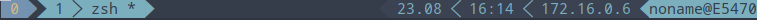

- high load >80%

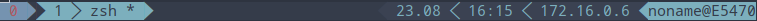

You don't need to install any complicated monitors to control the server load. As soon as you go to the server in the upper bar you will see all the load indicators:

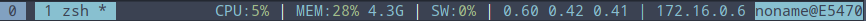

Now to use mapping `Ctrl+A` for local or server configuration you will need to use `F12`:

- before

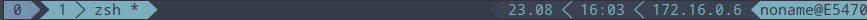

- after

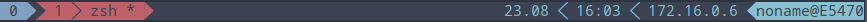
